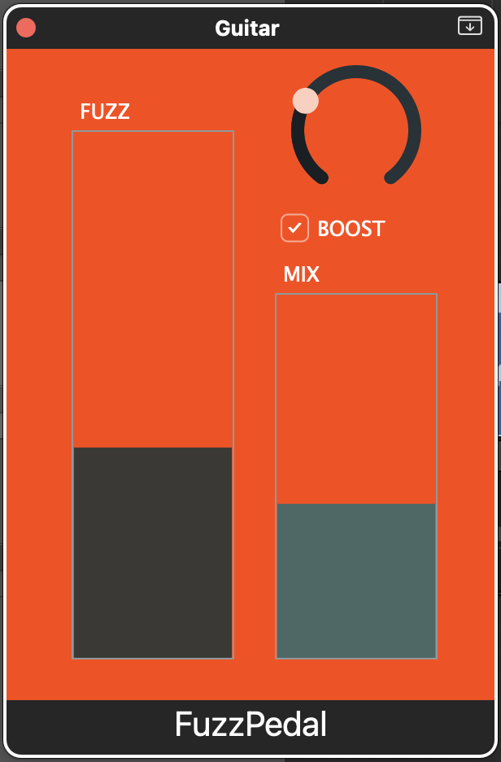

# FuzzPedal - AU & VST

## Controls

|                     |                                                       |                      |
| ------------------- | ----------------------------------------------------- | -------------------- |
| **FUZZ**            | Adjusts the clipping threshold                        | Higher = fuzzier     |
| **MIX**             | Wet:dry signal ratio                                  | Lower = moar cleaner |
| **LOW PASS (dial)** | Filter for removing excess high-end artifacts         |                      |
| **BOOST**           | Reverses the clipping for extra distortion and volume |                      |

Initially based on this tutorial: https://www.youtube.com/watch?v=7JUvVnRZrjg

Also, these:

- https://audioordeal.co.uk/how-to-build-a-distortion-vst/
- https://www.youtube.com/watch?v=nTVXy35rG4Q
- https://docs.juce.com/master/tutorial_look_and_feel_customisation.html
- https://docs.juce.com/master/tutorial_radio_buttons_checkboxes.html
